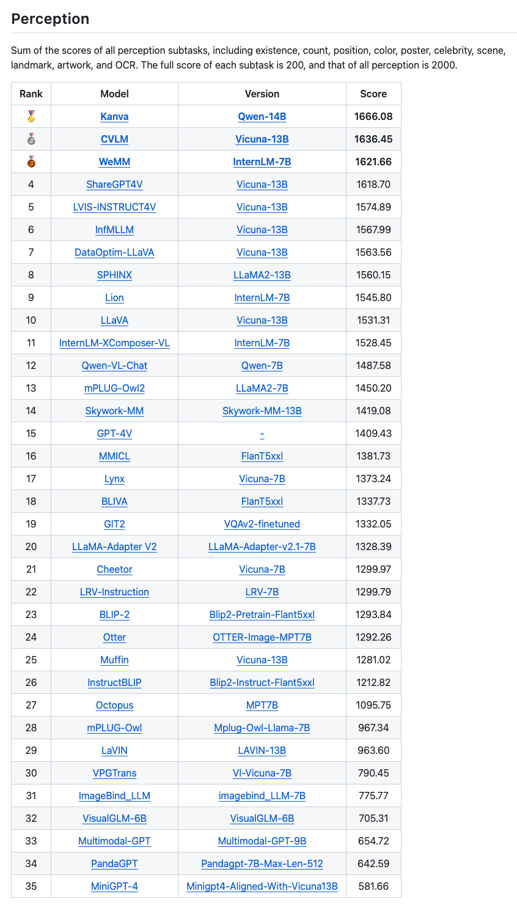

# Kanva

Kanva: **K**nowledge-**A**ware la**N**guage-and-**V**ision **A**ssistant, by the KaLM team.

The quality of instructions is a pivotal element for Instruction-tuned Vision Language Models. We propose a mechanism integrating world knowledge in LLMs to evolve visual instructions to improve the quality of such datasets. Using this mechanism, we construct a dataset evolved from existing public resources.

We show that by applying the dataset on existing model architectures and training recipes, their zero-shot capabilities are significantly improved. After applying the evolved dataset on off-the-shelf language models, our new model series, Kanva, achieve remarkably higher results on MME and MMBench benchmarks compared to the baseline models such as LLaVA.

## Model Architecture

As demonstrated in the figure, we simply adopt the LLaVA model's architecture as well as the training recipe. The models are trained based on public vision-language instructions data, evolved with our rule-based and LLM-based instruction evolution procedure.

### Settings

|  **Model**     |  **Vision**        | **Language**     | **Parameters** |
|----------------|--------------------|------------------|----------------------|
| Kanva-7B       | EVA-CLIP-L/336 | Baichuan2-7B |  7.2B      |
| Kanva-14B      | EVA-CLIP-L/336 | Qwen-14B     |  14.2B      |

## Evaluation

We benchmark two models in the Kanva series, Kanva-14B and Kanva-7B, trained with different language components. The results are reported below.

### MME
Kanva achieved 1666.08 perception score, which was top1 on MME full benchmark on 2023-11-24

### MMBench

To be announced.

## Acknowledgements

- [LLaVA](https://github.com/haotian-liu/LLaVA)
- [CLIP](https://github.com/openai/CLIP)
- [Qwen](https://github.com/QwenLM/Qwen)
- [Baichuan](https://github.com/baichuan-inc/Baichuan-7B)
